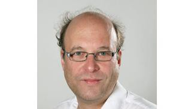
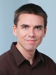
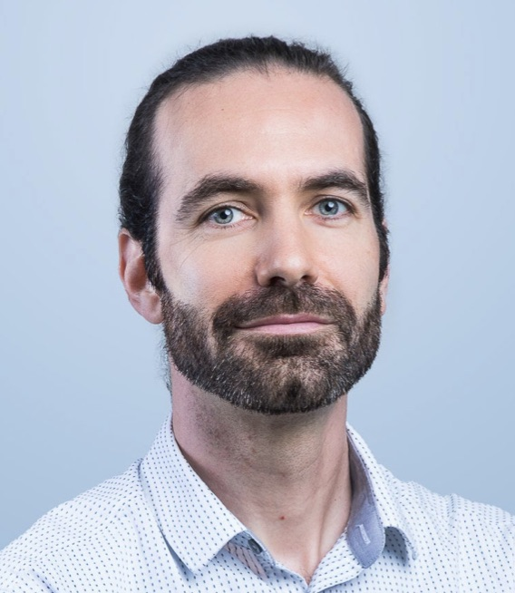
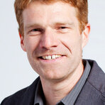
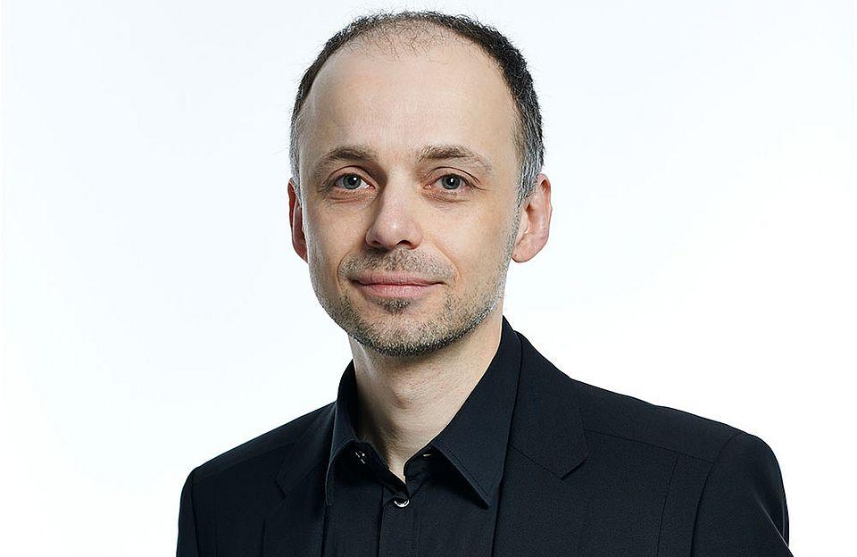
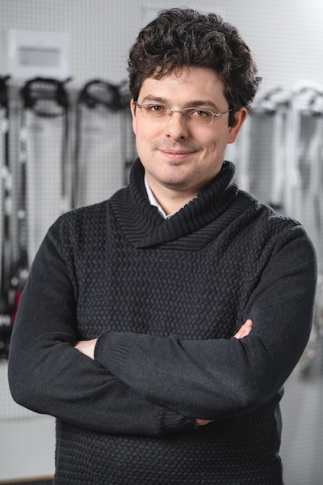
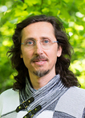
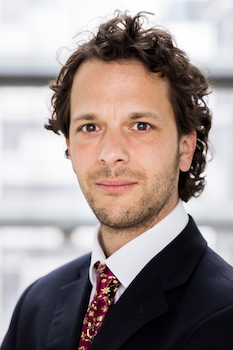
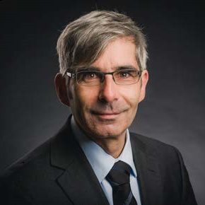

+++
title = "Nodes"
date = "2020-04-21"
+++

Nodes, or Local Networks, provide a mechanism through which the aims of the SwissRN can be promoted within that institution (e.g., by establishing open research working groups, running training workshops, advocating for the wider adoption of best practice within the institution, etc.).

## Local Network Leads
A Local Network Lead provides the point of contact for SwissRN, and represents a grass-roots network of researchers at that institution. It is intended that these Local Networks will grow, both in number and size, over time, as researchers elect to participate in SwissRN activities. Local Networks are self-organizing, but we encourage them to ensure their membership is open to academic and research staff (at all levels) and professional services staff.

Department|Institution|   Contact   |  |
--------------|---|-------------|---|
[LPSY – Laboratory of Psychophysics](https://www.epfl.ch/labs/lpsy/team/herzog/)|https://www.epfl.ch/en/| Prof. Michael Herzog |   |
[Department of Biosystems Science and Engineering](https://bsse.ethz.ch/department/people/detail-person.MTQ5NDE3.TGlzdC8yNjY5LDEwNjI4NTM0MDk=.html/)| Prof. Dr. Niko Beerenwinkel |   |
[FernUni](https://fernuni.ch/forschung/forschung-fakultaeten/psychologie/forschungsgruppe-nicolas-rothen/nicolas-rothen/)| Prof. Dr. Nicolas Rothen |   |
[Department of Environmental Sciences](https://duw.unibas.ch/en/persons/valentin-amrhein-2310/)| Prof. Dr. Valentin Amrhein |   |
[Faculty of Business and Economics](https://wwz.unibas.ch/en/kleiber/)| Prof. Dr. Christian Kleiber |   |
[Institute of Social and Preventive Medicine (ISPM)](https://www.ispm.unibe.ch/about_us/staff/low_nicola/index_eng.html)| Prof. Dr. med., MSc FFPH Nicola Low |   |
[Department of Clinical Research and Veterinary Public Health (DCR-VPH)](https://www.dcr-vph.unibe.ch/ueber_uns/personen/prof_dr_wuerbel_hanno/index_ger.html)| Prof. Dr. Hanno Würbel, Veterinary Science           |  |
[Consumer Behavior (ISPM)](https://www.crs.uzh.ch)| PD Dr. Michael Schulte-Mecklenbeck |   |
[Departement für Psychologie ](https://www3.unifr.ch/psycho/de/departement/mitarbeitende/dept/people/185474/78b81)| Dr. Meike Ramon |   |
[Swiss Center for Affective Sciences ](https://www.unige.ch/cisa/members/cova-florian/)| Prof. Florian Cova |   |
[Fondation Campus Biotech ](https://people.epfl.ch/michael.dayan)| Michaël Jérémy Pierre Dayan |   |
[Department of Ecology and Evolution ](https://www.unil.ch/dee/en/home/menuinst/people/group-leaders/prof-marc-robinson-rechavi.html)| Prof. Marc Robinson |   |
[University of Neuchâtel](https://www.unine.ch/tania.zittoun/home.html)| Prof. Tania Zittoun, Institute of Psychology and Education           |  |
[Institut de Psychologie du Travail et des Organisations](https://www.unine.ch/ipto/home/collaborateurstrices/laurenzmeier.html)| Laurenz Meier           |  |
[Center for Reproducible Science](https://www.ebpi.uzh.ch/en/aboutus/departments/biostatistics/teambiostats/held.html)| Prof. Dr. Leonhard Held           |  |
[Psychologisches Institut](https://www.psychologie.uzh.ch/de/bereiche/sob/sozpsy/Team1/jullrich.html)| Prof. Dr. Johannes Ullrich           |  |
[ZHAW Gesundheit](https://www.zhaw.ch/de/ueber-uns/person/gerd/)| Prof. Dr. Andreas Gerber-Grote           |  |

## Local Network Contact Points
jklhsjkhfjk

It makes use of a variety of open source projects including:

* [Cobra](https://github.com/spf13/cobra)
* [Viper](https://github.com/spf13/viper)
* [J Walter Weatherman](https://github.com/spf13/jWalterWeatherman)
* [Cast](https://github.com/spf13/cast)

Learn more and contribute on [GitHub](https://github.com/spf13).

## Setup

Some fun facts about [Hugo](http://gohugo.io/):

* Built in [Go](http://golang.org/)
* Loosely inspired by [Jekyll](http://jekyllrb.com/)
* Primarily developed by [spf13](http://spf13.com/) on the train while commuting to and from Manhattan.
* Coded in [Vim](http://vim.org) using [spf13-vim](http://vim.spf13.com/)

Have questions or suggestions? Feel free to [open an issue on GitHub](https://github.com/spf13/hugo/issues/new) or [ask me on Twitter](https://twitter.com/spf13).

Thanks for reading!
