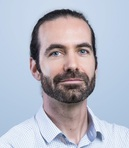

+++
author = "Updated by Eva Furrer"
title = "Nodes"
date = "2021-05-21"
tags = ["Local Nodes"]
categories = ["Nodes"]
+++
`Go to:` [*`Local Node Leaders`*](#local-node-leaders)    &nbsp; [*`Local Node Activities`*](#local-node-activities)    &nbsp; [*`Local Node Members`*](#local-node-members)    &nbsp; [*`How to join`*](#how-to-join)

Local Nodes of the SwissRN build the backbone of the network by initiating and coordinating activities at universities and other research institutions. Activities of local nodes are manifold, e.g.

* open research working groups
* ReproducibiliTea journal clubs
* organisation of training activities such as carpentries workshops
* grant and ethics peer review groups etc

The organisation of local nodes differs from institution to institution: from a formalised administration to informal grassroot groups. SwissRN encourages to ensure that membership is open to academic and research staff (at all levels) and professional services staff. Each Local Node has a Local Node Leader providing the point of contact for SwissRN.

### Local Node Leaders {#local-node-leaders}
Institution |  Unit |   Contact   |  |
--------------|---|-------------|---|
[CERN](https://home.cern/) | Information Technology | [Tibor Simko](https://orcid.org/0000-0001-7202-5803)|   |
[&Eacute;cole polytechnique f&eacute;d&eacute;rale de Lausanne (EPFL)](https://www.epfl.ch/en/) | Neuroscience -- Brain Mind Institute | [Michael Herzog](https://www.epfl.ch/labs/lpsy/team/herzog/)|   |
[EPFL/Unige Campus Biotech](https://www.campusbiotech.ch/) | Fondation Campus Biotech | [Micha&euml;l Dayan](https://www.campusbiotech.ch/en/people/michael-dayan) |   |
[ETH](https://www.ethz.ch) | NEXUS Personalized Health Technologies | [Daniel Stekhoven](https://www.nexus.ethz.ch/people/person-detail.html?persid=143058) |   |
[FernUni Schweiz](https://fernuni.ch)| Psychology / Applied Mathematics | [Nicolas Rothen](https://fernuni.ch/forschung/forschung-fakultaeten/psychologie/forschungsgruppe-nicolas-rothen/nicolas-rothen/) / [Matthias Voigt](https://fernuni.ch/matthias-voigt/)|    |
[Lausanne University Hospital (CHUV)](https://www.chuv.ch/fr/chuv-home) | Precision Medicine Unit  | [Romain-Daniel Gosselin](https://www.chuv.ch/fr/medecine-precision/accueil/en-bref/notre-equipe/romain-daniel-gosselin) |   |
[Haute école de gestion de Genève (HEG-Genève)](https://www.hesge.ch/heg/ ) |Data Mining and Machine Learning group  | [Grigorios Anagnostopoulos](http://dmml.ch/grigorios-anagnostopoulos/) |   |
[St.Gallen University of Teacher Education](https://www.phsg.ch/en)|Research Methods Working Group| [Michael Beck](https://www.phsg.ch/de/team/prof-dr-michael-beck) |   |
[Swiss Institute of Bioinformatics (SIB)](https://www.sib.swiss/) |Bioinformatics |[Patricia Palagi](https://www.sib.swiss/directory?cn=patricia%20palagi)|   |
[University of Basel (Unibas)](https://www.unibas.ch/en.html)| Department of Environmental Sciences| [Valentin Amrhein](https://camargue.unibas.ch/en/team/valentin-amrhein/) |   |
[University of Bern (Unibe)](https://www.unibe.ch/index_eng.html)| Institut f&uuml;r Marketing und Unternehmensf&uuml;hrung (IMU) | [Michael Schulte-Mecklenbeck](https://www.consumer.imu.unibe.ch/ueber_uns/team/prof_dr_schulte_mecklenbeck_michael/index_ger.html) |   |
[University of Fribourg (Unifr)](https://www.unifr.ch/home/en.html)| Department of Psychology | [Meike Ramon](https://www3.unifr.ch/psycho/de/departement/mitarbeitende/dept/people/185474/78b81) |   |
[University of Geneva (Unige)](https://www.unige.ch)| Swiss Center for affective Sciences/ Faculty of Psychology and Educational Sciences | [Florian Cova](https://www.unige.ch/cisa/members/cova-florian/)/ [Evie Vergauwe](https://neurocenter-unige.ch/research-groups/evie-vergauwe/) |    |
[University of Lausanne (Unil)](https://www.unil.ch/index.html)| Persuasive Technology Lab | [Mauro Cherubini](https://www.maurocherubini.it) |   |
[Universit&eacute; de Neuch&acirc;tel (Unine)](https://www.unine.ch/unine/home.html)| Institut de Psychologie du Travail et des Organisations | [Laurenz Meier](https://www.unine.ch/ipto/home/collaborateurstrices/laurenzmeier.html) |  |
[Università della Svizzera italiana (USI)](https://www.usi.ch/)| Data Science Lab | [Antonietta Mira](https://usi.to/exz) |  |
[University of Zurich (UZH)](https://www.uzh.ch/en.html)| Center for Reproducible Science| [Leonhard Held](https://www.ebpi.uzh.ch/en/aboutus/departments/biostatistics/teambiostats/held.html) |  |

&nbsp;  

### Local Node Activities {#local-node-activities}
Activity |  Unit |   Institution   | Contact  |
--------------|---|-------------|---|
[Open Science Initiative](https://www.psychologie.uzh.ch/de/dienstleistungen/open-science.html) | [Department of Psychology](https://www.psychology.uzh.ch/en.html) | [UZH](https://www.uzh.ch/en.html)| [Johannes Ullrich](https://www.psychologie.uzh.ch/de/bereiche/sob/sozpsy/Team1/jullrich.html) |
[Center for Reproducible Science](https://www.crs.uzh.ch/en.html) |  [UZH](https://www.uzh.ch/en.html)| [UZH](https://www.uzh.ch/en.html)| [Leonhard Held](https://www.ebpi.uzh.ch/en/aboutus/departments/biostatistics/teambiostats/held.html) |
[Swiss Open Psychological Science Initiative (SOPSI)](https://www.sopsi.org/about-us) | [Faculty of Psychology and Educational Sciences](https://www.unige.ch/fapse/en/) | [Unige](https://www.unige.ch/en/university/presentation/) and [UZH](https://www.uzh.ch/en.html)|[Evie Vergauwe](https://neurocenter-unige.ch/research-groups/evie-vergauwe/)  |
[Promoting more reliable research and communication of results](https://camargue.unibas.ch/en/reproducibility/) | [Department of Environmental Sciences](https://duw.unibas.ch/en/) | [Unibas](https://www.unibas.ch/en.html)|[Valentin Amrhein](https://camargue.unibas.ch/en/team/valentin-amrhein/)  |

&nbsp;

### Local Node Members {#local-node-members}



&nbsp;

### How to join {#how-to-join}
If you are organising a local group with pertinent activities/goals and want to become a Local SwissRN Node please send an email to [Eva Furrer](mailto:eva.furrer@uzh.ch).
