+++
author = "Updated by Zhixuan Li"
title = "Nodes"
date = "2023-10-24"
tags = ["Local Nodes"]
categories = ["Nodes"]
+++
`Go to:` [*`Local Node Leaders`*](#local-node-leaders)    &nbsp; [*`Local Node Activities`*](#local-node-activities)    &nbsp; [*`Local Node Members`*](#local-node-members)    &nbsp; [*`How to join`*](#how-to-join)

Local Nodes of the SwissRN build the backbone of the network by initiating and coordinating activities at universities and other research institutions. Activities of local nodes are manifold, e.g.

* open research working groups
* ReproducibiliTea journal clubs
* organisation of training activities such as carpentries workshops
* grant and ethics peer review groups etc

The organisation of local nodes differs from institution to institution: from a formalised administration to informal grassroot groups. SwissRN encourages to ensure that membership is open to academic and research staff (at all levels) and professional services staff. Each Local Node has a Local Node Leader providing the point of contact for SwissRN.

### Local Node Leaders {#local-node-leaders}
Institution |  Unit |   Contact   |  |
--------------|---|-------------|---|
[CERN](https://home.cern/) | Information Technology | [Tibor Simko](https://orcid.org/0000-0001-7202-5803)  |   |
[&Eacute;cole polytechnique f&eacute;d&eacute;rale de Lausanne (EPFL)](https://www.epfl.ch/en/) | Neuroscience -- Brain Mind Institute | [Michael Herzog](https://www.epfl.ch/labs/lpsy/team/herzog/) | 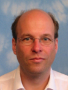  |
[EPFL/Unige Campus Biotech](https://www.campusbiotech.ch/) | Fondation Campus Biotech | [Micha&euml;l Dayan](https://www.campusbiotech.ch/en/people/michael-dayan)  | 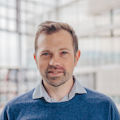 |
[ETH Z&uuml;rich](https://www.ethz.ch) | NEXUS Personalized Health Technologies | <nobr>[Daniel Stekhoven](https://www.nexus.ethz.ch/about/people1/person-detail.html?persid=143058)  |   |
[FernUni Schweiz](https://fernuni.ch)| Economics / Applied Mathematics | [Michael Kurschilgen](https://fernuni.ch/profil/michael-kurschilgen)   /   [Matthias Voigt](https://fernuni.ch/matthias-voigt/)  | 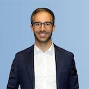   |
[Haute Ecole Spécialisée de Suisse occidentale (HES-SO)](https://www.hes-so.ch/de/startseite) |Data Mining and Machine Learning group  | [Grigorios Anagnostopoulos](http://dmml.ch/grigorios-anagnostopoulos/)  | 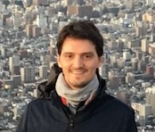  |
[Idiap Research Institute](https://www.idiap.ch/en/about)| AI for Trust Group and Biometrics Security & Privacy Group /  Biosignal Processing Group | <nobr>[Sébastien Marcel](https://www.idiap.ch/en/people/directory/128)  /  [André Anjos](https://anjos.ai)  | 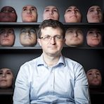   |
[St.Gallen University of Teacher Education](https://www.phsg.ch/en)|Research Methods Working Group| [Michael Beck](https://www.phsg.ch/de/team/prof-dr-michael-beck)  |  |
[Swiss Institute of Bioinformatics (SIB)](https://www.sib.swiss/) |Bioinformatics |[Patricia Palagi](https://www.sib.swiss/directory?cn=patricia%20palagi)  |   |
[University of Basel / ](https://www.unibas.ch/en.html)  [University Hospital Basel](https://www.unispital-basel.ch/)| Department of Environmental Sciences/ Department of Biomedical Engineering| <nobr>[Valentin Amrhein](https://camargue.unibas.ch/en/team/valentin-amrhein/)  /   <nobr>[Xeni Deligianni](https://www.xenideligianni.com)  |  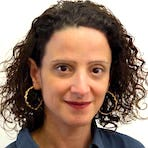 |
[University of Bern (Unibe)](https://www.unibe.ch/index_eng.html)| Veterinary Public Health Institute, Animal Welfare Division | <nobr>[Bernhard Voelkl](https://www.tierschutz.vetsuisse.unibe.ch/about_us/personnel/dr_voelkl_bernhard/index_eng.html#pane740819)  | 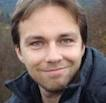 |
[University of Geneva (Unige)](https://www.unige.ch)| Swiss Center for affective Sciences/ Faculty of Psychology and Educational Sciences | [Florian Cova](https://www.unige.ch/cisa/members/cova-florian/)  /  [Evie Vergauwe](https://neurocenter-unige.ch/research-groups/evie-vergauwe/)  | 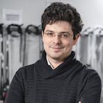   |
[University of Lausanne (Unil)](https://www.unil.ch/index.html)| Persuasive Technology Lab/   Applied Face Cognition Lab (AFC Lab) | <nobr>[Mauro Cherubini](https://www.maurocherubini.it)  /   [Meike Ramon](https://afclab.org/)  | 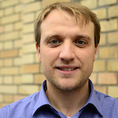   |
[Universit&eacute; de Neuch&acirc;tel (Unine)](https://www.unine.ch/unine/home.html)| Institut de Psychologie du Travail et des Organisations | [Laurenz Meier](https://www.unine.ch/ipto/home/collaborateurstrices/laurenzmeier.html)  |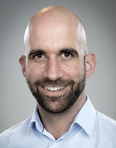  |
[Università della Svizzera italiana (USI)](https://www.usi.ch/)| Data Science Lab | [Antonietta Mira](https://usi.to/exz)  |  |
[University of Zurich (UZH)](https://www.uzh.ch/en.html)| Center for Reproducible Science| [Leonhard Held](https://www.ebpi.uzh.ch/en/aboutus/departments/biostatistics/teambiostats/held.html)  |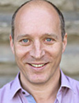  |
[Zurich University of Applied Sciences (ZHAW)](https://zhaw.ch)| Institute of Data Analysis and Process Design (IDP) | [Christoph Hofer](https://www.zhaw.ch/en/about-us/person/hofc/) | 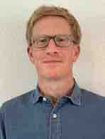  |
<!-- [Lausanne University Hospital (CHUV)](https://www.chuv.ch/fr/chuv-home) | Precision Medicine Unit  | [Romain-Daniel Gosselin](https://www.chuv.ch/fr/medecine-precision/accueil/en-bref/notre-equipe/romain-daniel-gosselin) | 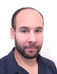  | -->

&nbsp;  

### Local Node Activities {#local-node-activities}
Activity |  Unit |   Institution   | Contact  |
--------------|---|-------------|---|
[Open Science Initiative](https://www.psychologie.uzh.ch/de/dienstleistungen/open-science.html) | [Department of Psychology](https://www.psychology.uzh.ch/en.html) | [UZH](https://www.uzh.ch/en.html)| [Johannes Ullrich](https://www.psychologie.uzh.ch/de/bereiche/sob/sozpsy/Team1/jullrich.html) |
[Center for Reproducible Science](https://www.crs.uzh.ch/en.html) |  [UZH](https://www.uzh.ch/en.html)| [UZH](https://www.uzh.ch/en.html)| [Leonhard Held](https://www.ebpi.uzh.ch/en/aboutus/departments/biostatistics/teambiostats/held.html) |
[Swiss Open Psychological Science Initiative (SOPSI)](https://uzh-unige.ch/2021/09/06/on-the-path-to-transparent-and-reproducible-science-swiss-open-psychological-science-initiative-sopsi/) | [Faculty of Psychology and Educational Sciences](https://www.unige.ch/fapse/en/) | [Unige](https://www.unige.ch/en/university/presentation/) and [UZH](https://www.uzh.ch/en.html)|[Evie Vergauwe](https://neurocenter-unige.ch/research-groups/evie-vergauwe/)  |
[Promoting more reliable research and communication of results](https://camargue.unibas.ch/en/reproducibility/) | [Department of Environmental Sciences](https://duw.unibas.ch/en/) | [Unibas](https://www.unibas.ch/en.html)|[Valentin Amrhein](https://camargue.unibas.ch/en/team/valentin-amrhein/)  |

&nbsp;

### Local Node Members {#local-node-members}




&nbsp;

### How to join {#how-to-join}
If you are organising a local group with pertinent activities/goals and want to become a Local SwissRN Node please send an email to [Manuela H&ouml;fler](mailto:info@swissrn.org).
