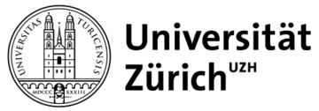

+++
author = "Updated by Eva Furrer"
title = "Organisation"
date = "2021-05-31"
tags = ["Committees"]
categories = ["Organisation"]

+++
`Go to:` [*`Steering Committee`*](#steering-committee)    &nbsp; [*`Institutions`*](#institutions)    &nbsp; [*`Stakeholders`*](#stakeholders)    &nbsp; [*`Advisory Board`*](#advisory-board)    &nbsp; [*`Coordinator`*](#coordinator)

### Steering Committee {#steering-committee}
The steering committee is responsible for the overall coordination of SwissRN activity and strategy.

Institution | Unit |   Name   |  |
--------------|---|-------------|---|
[University of Zurich](https://www.uzh.ch/en.html)|Faculty of Science and Faculty of Medicine, Center for Reproducible Science| [Leonhard Held](https://www.ebpi.uzh.ch/en/aboutus/departments/biostatistics/teambiostats/held.html) |  |
[University of Geneva](https://unige.ch)| Faculty of Psychology and Educational Sciences, Swiss Open Psychological Science Initiative | [Evie Vergauwe](https://neurocenter-unige.ch/research-groups/evie-vergauwe/) |   |
[University of Bern](https://www.unibe.ch/index_eng.html)| Vetsuisse Faculty Bern, Swiss 3R Competence Centre| [Hanno W&uuml;rbel](https://www.tierschutz.vetsuisse.unibe.ch/about_us/personnel/prof_dr_wuerbel_hanno/index_eng.htmll) |  |

&nbsp; 

### Institutions  {#institutions}  
Member institutions of the SwissRN are formally committed to support the aims of SwissRN and have begun implementing them. Current institutional members are:

Institution |  | Contact person
--------|------ |------
[FernUni Schweiz / UniDistance Suisse](https://fernuni.ch/)|  | [Prof. Dr. Walter Perrig](https://fernuni.ch/ueber-uns/organisation/direktion/), Vice Rector Research |
[University of Basel](https://www.unibas.ch) |  | [Dr. Frank Neumann](https://www.unibas.ch/en/University/Administration-Services/Vice-President-for-Research/Research-Office.html), Head Research Office |
[University of Bern](https://www.unibe.ch) |  |     [Prof. Dr. Daniel Candinas](https://www.unibe.ch/university/organization/executive_board_and_central_administration/vice_rectorate_research/prof_dr_candinas_daniel/index_eng.html), Vice Rector for Research  |
[University of Geneva](https://www.unige.ch) |  |[Prof. Dr. Antoine Geissbuhler](https://www.unige.ch/rectorat/en/home/vice-recteur-antoine-geissbuhler/), Vice Rector Digital Transformation  |
[University of Fribourg](https://www.unifr.ch) |  |[Prof. Dr. Bernhard Ries](https://www.unifr.ch/uni/fr/organisation/direction/relations-internationales/ries.html), Vice Rector  International Relations, Digitalisation and Interdisciplinarity  |
[University of Zurich](https://www.uzh.ch) |  | [Prof. Dr. Elisabeth Stark](https://www.research.uzh.ch/de/vp/Prorektor-in-Forschung.html), Vice President Research |

&nbsp;  

**Become a SwissRN Institution**

We expect that institutions seeking membership of SwissRN will want to develop capacity to deliver a research improvement strategy, and to work with SwissRN to develop a strategy for ensuring the sustainability of SwissRN in the medium- and long-term, and to build a community of institutions focused on research improvement.

Interested institutions please send an email to [Eva Furrer](mailto:eva.furrer@uzh.ch).

### Stakeholders  {#stakeholders}  
Stakeholders who support the SwissRN form the Stakeholder Engagement Group with the goal of

* aligning SwissRN activity with the strategy and activity of the stakeholders
* allowing the exchange of ideas
* facilitating feedback on new stakeholder initiatives
&nbsp;

Institution |  | Contact person |
--------------|-------------|---|
[Swiss National Science Foundation](http://www.snf.ch/en/Pages/default.aspx/)|  | Dr. Katrin Milzow, head of strategy |
[Swiss Academies of Arts and Sciences](http://www.swiss-academies.ch/en/index/Aktuell/News.html)|  | Claudia Appenzeller  |
[FORS - Swiss Centre of Expertise in the Social Sciences](https://www.forscenter)|  | Dr. Marieke Heers |

&nbsp;  

**Become a stakeholder in SwissRN**

Potential stakeholders include funders (both governmental and charity) and non-profit organisations that are part of the academic environment. To become a member of the Stakeholder Engagement Group an organization has to provide direct financial support or support in kind to SwissRN and is required to agree to our mission and values.

If you would like to become a member of the Stakeholder Engagement Group of the Swiss Reproducibility Network, please send an email to [Eva Furrer](mailto:eva.furrer@uzh.ch).

### Advisory Board {#advisory-board}
An external Advisory Board comprising academics from the international research community with expertise related to the goals of the network supports the steering committee regarding strategy and direction.

Institution| Unit/Function | Name |  |
--------------|---|-------------|---|
[Tilburg University](https://www.tilburguniversity.edu)| Department of Methodology | [Mich&egrave;le B. Nuijten](https://mbnuijten.com) |  |
[University of Bristol](https://www.bristol.ac.uk)| School of Psychological Science | [Marcus Munafo](http://www.bristol.ac.uk/expsych/people/marcus-r-munafo/) |  |
[National Centre for the Replacement, Refinement and Reduction of Animals in Research](https://www.nc3rs.org.uk/)|  Head of Experimental Design and Reporting | [Nathalie Percie Du Sert](https://www.nc3rs.org.uk/dr-nathalie-percie-du-sert) |  |
Former head of Competence Centre for Methodology and Statistics at the Luxembourg Institute of Health | Statistical Consultancy for the Pharmaceutical Industry | [Stephen Senn](http://www.senns.demon.co.uk/Consult.htm) |  |

&nbsp;

### Coordinator {#coordinator}
Institution|   Name & Contact   |  |
--------------|---|-------------|
[University of Zurich (UZH)](https://www.uzh.ch/en.html) | [Eva Furrer](https://www.ebpi.uzh.ch/en/aboutus/departments/biostatistics/teambiostats/furrer.html), SwissRN coordinator. Please send inquiries to [eva.furrer@uzh.ch](mailto:eva.furrer@uzh.ch) |  |
