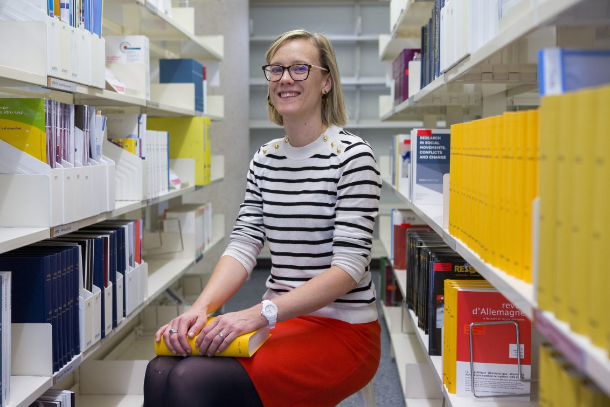

+++
title = "Organisation"
date = "2020-04-21"
+++

## Steering Committee
The steering committee is responsible for the overall coordination of SwissRN activity and strategy. 

Department | Institution|   Contact   |  |
--------------|---|-------------|---|
[Center for Reproducible Science](https://www.ebpi.uzh.ch/en/aboutus/departments/biostatistics/teambiostats/held.html)| [UZH](https://www.uzh.ch/en.html) | Prof. Dr. Leonhard Held |  |
[Geneva University Neurocenter](https://neurocenter-unige.ch/research-groups/evie-vergauwe/)| [University of Geneva](https://unige.ch) | Evie Vergauwe |  |
[Department of Clinical Research and Veterinary Public Health (DCR-VPH)](https://www.dcr-vph.unibe.ch/ueber_uns/personen/prof_dr_wuerbel_hanno/index_ger.html)| [University of Bern](https://www.unibe.ch/index_eng.html)| Prof. Dr. Hanno W&uuml;rbel, Veterinary Science |  |

## Advisory Board
An external Advisory Board comprising academics from the international research community with expertise related to the goals of the network supports the steering committee regarding strategy and direction. 

Department | Institution|   Contact   |  |
--------------|---|-------------|---|
[Department](https://www.ebpi.uzh.ch/en/aboutus/departments/biostatistics/teambiostats/held.html)| [Institution](https://www.uzh.ch/en.html) | Contact |  |
[Department](https://www.ebpi.uzh.ch/en/aboutus/departments/biostatistics/teambiostats/held.html)| [Institution](https://www.uzh.ch/en.html) | Contact |  |
[Department](https://www.ebpi.uzh.ch/en/aboutus/departments/biostatistics/teambiostats/held.html)| [Institution](https://www.uzh.ch/en.html) | Contact |  |
[Department](https://www.ebpi.uzh.ch/en/aboutus/departments/biostatistics/teambiostats/held.html)| [Institution](https://www.uzh.ch/en.html) | Contact |  |

## SwissRN coordinator

Department | Institution|   Contact   |  |
--------------|---|-------------|---|
[Department](https://www.ebpi.uzh.ch/en/aboutus/departments/biostatistics/teambiostats/held.html)| [Institution](https://www.uzh.ch/en.html) | Eva Furrer |  |

## Contact
The primary contact point for SwissRN is currently, please send an email to [Eva Furrer](mailto:eva.furrer@uzh.ch) for more information.

## Subscribe to our Newsletter

It makes use of a variety of open source projects including:

* [Cobra](https://github.com/spf13/cobra)
* [Viper](https://github.com/spf13/viper)
* [J Walter Weatherman](https://github.com/spf13/jWalterWeatherman)
* [Cast](https://github.com/spf13/cast)

Learn more and contribute on [GitHub](https://github.com/spf13).

## Setup

Some fun facts about [Hugo](http://gohugo.io/):

* Built in [Go](http://golang.org/)
* Loosely inspired by [Jekyll](http://jekyllrb.com/)
* Primarily developed by [spf13](http://spf13.com/) on the train while commuting to and from Manhattan.
* Coded in [Vim](http://vim.org) using [spf13-vim](http://vim.spf13.com/)

Have questions or suggestions? Feel free to [open an issue on GitHub](https://github.com/spf13/hugo/issues/new) or [ask me on Twitter](https://twitter.com/spf13).

Thanks for reading!
