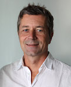

+++
title = "Organisation"
date = "2020-04-21"
+++

The Swiss Reproducibility Network (SwissRN) is a peer-led consortium that aims to promote and ensure rigorous research practices in Switzerland by establishing appropriate training activities, designing and evaluating research improvement efforts, disseminating best practice, and working with stakeholders to ensure coordination of efforts across the sector. SwissRN’s activities span multiple levels, including researchers, institutions and other stakeholders (e.g., funders and public authorities).

## Steering Committee
The steering committee consists of three to four persons (currently Leonhard Held, Evie Vergauwe, Hanno Würbel) and is responsible for the overall coordination of SwissRN activity and strategy. It is supported by a part-time administrator, the SwissRN coordinator.

Department | Institution|   Contact   |  |
--------------|---|-------------|---|
[Center for Reproducible Science](https://www.ebpi.uzh.ch/en/aboutus/departments/biostatistics/teambiostats/held.html)| [UZH](https://www.uzh.ch/en.html) | Prof. Dr. Leonhard Held |  |
[Geneva University Neurocenter](https://neurocenter-unige.ch/research-groups/evie-vergauwe/)| [University of Geneva](https://unige.ch) | Evie Vergauwe |  |
[Department of Clinical Research and Veterinary Public Health (DCR-VPH)](https://www.dcr-vph.unibe.ch/ueber_uns/personen/prof_dr_wuerbel_hanno/index_ger.html)| [University of Bern](https://www.unibe.ch/index_eng.html)| Prof. Dr. Hanno Würbel, Veterinary Science |  |

## Advisory Board
The Steering Group is advised by an external Advisory Board comprising (senior) academics from the international research community with expertise related to the goals of the network. Members of the Advisory Board are asked to serve a three-year term in the first instance, with the option to renew this for a further three years at the end of this term.

Department | Institution|   Contact   |  |
--------------|---|-------------|---|
[Department](https://www.ebpi.uzh.ch/en/aboutus/departments/biostatistics/teambiostats/held.html)| [Institution](https://www.uzh.ch/en.html) | Contact |  |
[Department](https://www.ebpi.uzh.ch/en/aboutus/departments/biostatistics/teambiostats/held.html)| [Institution](https://www.uzh.ch/en.html) | Contact |  |
[Department](https://www.ebpi.uzh.ch/en/aboutus/departments/biostatistics/teambiostats/held.html)| [Institution](https://www.uzh.ch/en.html) | Contact |  |
[Department](https://www.ebpi.uzh.ch/en/aboutus/departments/biostatistics/teambiostats/held.html)| [Institution](https://www.uzh.ch/en.html) | Contact |  |

## SwissRN coordinator
The Steering Group is advised by an external Advisory Board comprising (senior) academics from the international research community with expertise related to the goals of the network. Members of the Advisory Board are asked to serve a three-year term in the first instance, with the option to renew this for a further three years at the end of this term.

Department | Institution|   Contact   |  |
--------------|---|-------------|---|
[Department](https://www.ebpi.uzh.ch/en/aboutus/departments/biostatistics/teambiostats/held.html)| [Institution](https://www.uzh.ch/en.html) | Eva Furrer |  |

## Contact
We expect that institutions seeking membership of SwissRN will want to develop capacity to deliver a research improvement strategy, and to work with SwissRN to develop a strategy for ensuring the sustainability of the Network in the medium- and long-term, and to build a community of institutions focused on research improvement.

If you would like to become a supporter of the Swiss Reproducibility Network, please send us an email to [Eva Furrer](mailto:eva.furrer@uzh.ch) with subject "Subject".

## Subscribe to our Newsletter

It makes use of a variety of open source projects including:

* [Cobra](https://github.com/spf13/cobra)
* [Viper](https://github.com/spf13/viper)
* [J Walter Weatherman](https://github.com/spf13/jWalterWeatherman)
* [Cast](https://github.com/spf13/cast)

Learn more and contribute on [GitHub](https://github.com/spf13).

## Setup

Some fun facts about [Hugo](http://gohugo.io/):

* Built in [Go](http://golang.org/)
* Loosely inspired by [Jekyll](http://jekyllrb.com/)
* Primarily developed by [spf13](http://spf13.com/) on the train while commuting to and from Manhattan.
* Coded in [Vim](http://vim.org) using [spf13-vim](http://vim.spf13.com/)

Have questions or suggestions? Feel free to [open an issue on GitHub](https://github.com/spf13/hugo/issues/new) or [ask me on Twitter](https://twitter.com/spf13).

Thanks for reading!
