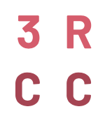

+++
title = "Stakeholders"
date = "2020-04-21"
+++

Stakeholders who support the SwissRN form the Stakeholder Engagement Group with the goal of

* aligning SwissRN activity with the strategy and activity of the stakeholders 
* allowing the exchange of ideas
* facilitating feedback on new stakeholder initiatives

## Stakeholders

Institution|   Contact   |  |
--------------|-------------|---|
[Swiss National Science Foundation](http://www.snf.ch/en/Pages/default.aspx/)| Contact |   |
[Swiss Academies](http://www.swiss-academies.ch/en/index/Aktuell/News.html)| Contact |   |
[Swiss Universities](https://www.swissuniversities.ch/en/)| Contact |   |
[SFVO](https://www.blv.admin.ch/blv/en/home.html/)| Contact |   |
[FOAG](https://www.blw.admin.ch/blw/en/home.html)| Contact |   |
[FOEN](https://www.bafu.admin.ch/bafu/en/home.html)| Contact |   |
[FORS](https://forscenter.ch)| Contact |   |
[SERI](https://www.sbfi.admin.ch/sbfi/en/home.html)| Contact |   |
[swissmedic](https://www.swissmedic.ch/swissmedic/de/home.html)| Contact |   |
[Swiss Ethics](https://swissethics.ch)| Contact |   |
[Ethics committees for animal experimentation](http://www.akademien-schweiz.ch/en/index/Portrait/Kommissionen-AG/Kommission-fuer-Tierversuchsethik.html)| Contact |   |
[Swiss 3R Competence Center](hhttps://www.swiss3rcc.org/en/)| Contact |   |
[Swiss Clinical Trial Organisation](https://www.scto.ch/de/news.html)| Contact |   |

## How to join
Potential stakeholders include funders (both governmental and charity) and non-profit organizations that are part of the academic environment. To become a member of the Stakeholder Engagement Group an organization has to provide direct financial support or support in kind to SwissRN and is required to agree to our mission and values.

If you would like to become a supporter of the Swiss Reproducibility Network, please send an email to [Eva Furrer](mailto:eva.furrer@uzh.ch).